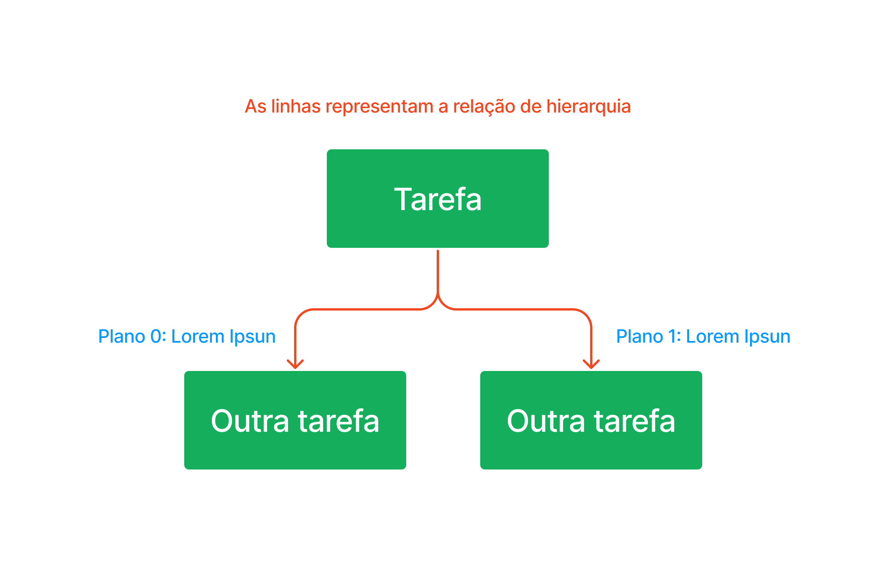

# Análise de tarefas

## Histórico de Versão
|Data|Data Prevista de Revisão|Versão|Descrição|Autor|Revisor|
| :----------: |:-----------:| :------: | :-----------: | :---------: |:---------: |
|03/12/2022|05/12/2022|1.0|Criação do documento|[Ana Luiza](https://github.com/AnHoff)|[Pedro Lucas](https://github.com/PedroLSF)|
|06/12/2022|07/12/2022|1.1|Adição do GOMS|[Pedro Lucas](https://github.com/PedroLSF)|[João Lucas](https://github.com/HacKairos)|
|07/12/2022|07/12/2022|1.2|Adição HTA|[Ana Luiza](https://github.com/AnHoff)|[Pedro Lucas](https://github.com/PedroLSF)|

## Introdução
A análise de tarefas é uma atividade que pode ser realizada em diversas etapas do desenvolvimento, inclusive antes mesmo dele começar. Essa atividade consiste em analisar a situação atual do produto para determinar como cada tarefa é realizada, seja com o apoio de softwares externos ou não. Também é possível realizar a análise após a implementação de intervenções no sistema já existente.

Dois métodos foram escolhidos para realizar a análise de tarefas nesse projeto, são eles:

* Hierarchical Task Analysis, ou HTA;
* GOMS, sigla para Goals, Operators, Methods and Selection Rules.

## HTA
Hierarchical Task Analysis (HTA) ou, em português, Análise Hierárquica de Tarefas (AHT), usa como base as tarefas a serem realizadas a fim de atingir um objetivo do usuário. Abaixo é possível conferir as principais tarefas que um usuário procura utilizar através do Simples Nacional. A listagem foi disponibilizada com base nas propostas de notação textual e gráfica; para entender essas notações, veja os exemplos abaixo:
 

#### Exemplo 1 - notação textual:

* **0 - Objetivo**
    * **1 - Tarefa 1**
        * 1.1 - Sub-tarefa 1
        * 1.2 - Sub-tarefa 2
    * **2 - Tarefa 2**
        * 2.1 - Sub-tarefa 1
        * 2.2 - Sub-tarefa 2

#### Exemplo 2 - notação gráfica:

 
Figura 1 - Exemplo de notação gráfica (elaboração própria)

 

### Representação em notação textual

#### Incluir Débito Automático
* **0 - Incluir débito automático**
    * **1 - Encontrar a opção desejada**
        * 1.1 - Abra o menu;
        * 1.2 - Escolha Débito Automático;
    * **2 - Acessar o débito automático**
        * 2.1 - Selecione o ícone de chave;
        * 2.2 - Realize o login;
    * **3 - Ativar o débito automático**
        * 3.1 - Selecionar a opção débito automático;
        * 3.2 - Selecionar "Inclusão";
        * 3.3 - Insira os dados necessários;
        * 3.4 - Selecione continuar.

Plano 0 - realize 1 - 2 - 3; 
Plano 1 - realize 1.1 - 1.2; 
Plano 2 - realize 2.1 - 2.2; 
Plano 3 - realize 3.1 - 3.2 - 3.3 - 3.4.

#### Consultar Débito Automático
* **0 - Consultar débito automático**
    * **1 - Encontrar a opção desejada**
        * 1.1 - Abra o menu;
        * 1.2 - Escolha Débito Automático;
    * **2 - Acessar o débito automático**
        * 2.1 - Selecione o ícone de chave;
        * 2.2 - Realize o login;
    * **3 - Consultar débito automático**
        * 3.1 - Selecionar a opção débito automático;
        * 3.2 - Selecionar "Consulta";
        * 3.3 - Selecione continuar.

Plano 0 - realize 1 - 2 - 3; 
Plano 1 - realize 1.1 - 1.2; 
Plano 2 - realize 2.1 - 2.2; 
Plano 3 - realize 3.1 - 3.2 - 3.3.

#### Alterar Débito Automático
* **0 - Alterar débito automático**
    * **1 - Encontrar a opção desejada**
        * 1.1 - Abra o menu;
        * 1.2 - Escolha Débito Automático;
    * **2 - Acessar o débito automático**
        * 2.1 - Selecione o ícone de chave;
        * 2.2 - Realize o login;
    * **3 - Alterar débito automático**
        * 3.1 - Selecionar a opção débito automático;
        * 3.2 - Selecionar "Alteração";
        * 3.3 - Insira os dados necessários;
        * 3.4 - Selecione continuar.

Plano 0 - realize 1 - 2 - 3; 
Plano 1 - realize 1.1 - 1.2; 
Plano 2 - realize 2.1 - 2.2; 
Plano 3 - realize 3.1 - 3.2 - 3.3 - 3.4.

#### Desativar Débito Automático
* **0 - Desativar débito automático**
    * **1 - Encontrar a opção desejada**
        * 1.1 - Abra o menu;
        * 1.2 - Escolha Débito Automático;
    * **2 - Acessar o débito automático**
        * 2.1 - Selecione o ícone de chave;
        * 2.2 - Realize o login;
    * **3 - Desativar débito automático**
        * 3.1 - Selecionar a opção débito automático;
        * 3.2 - Selecionar "Desativar";
        * 3.3 - Selecione continuar.

Plano 0 - realize 1 - 2 - 3; 
Plano 1 - realize 1.1 - 1.2; 
Plano 2 - realize 2.1 - 2.2; 
Plano 3 - realize 3.1 - 3.2 - 3.3.

#### Visualizar cálculos e declarações
* **0 - Visualizar cálculos e declarações**
    * **1 - Encontrar a opção desejada**
        * 1.1 - Abra o menu;
        * 1.2 - Escolha Cálculo e Declaração;
    * **2 - Acessar o cálculo e declaração**
        * 2.1 - Selecione o ícone de chave;
        * 2.2 - Realize o login;
    * **3 - Visualizar cálculo e declaração**
        * 3.1 - Selecionar o desenho de uma impressora.

Plano 0 - realize 1 - 2 - 3; 
Plano 1 - realize 1.1 - 1.2; 
Plano 2 - realize 2.1 - 2.2; 
Plano 3 - realize 3.1.

#### Pagar on-line
* **0 - Pagar on-line**
    * **1 - Encontrar a opção desejada**
        * 1.1 - Abra o menu;
        * 1.2 - Escolha Cálculo e Declaração;
    * **2 - Acessar o cálculo e declaração**
        * 2.1 - Selecione o ícone de chave;
        * 2.2 - Realize o login;
    * **3 - Pagar on-line**
        * 3.1 - Selecionar o desenho de um computador.

Plano 0 - realize 1 - 2 - 3; 
Plano 1 - realize 1.1 - 1.2; 
Plano 2 - realize 2.1 - 2.2; 
Plano 3 - realize 3.1.

#### Solicitar restituição
* **0 - Solicitar restituição**
    * **1 - Encontrar a opção desejada**
        * 1.1 - Abra o menu;
        * 1.2 - Escolha Restituição;
    * **2 - Acessar a área de restituição**
        * 2.1 - Selecione o ícone de chave;
        * 2.2 - Realize o login;
    * **3 - Solicitar restituição**
        * 3.1 - Selecionar "Solicitar Restituição";
        * 3.2 - Digitar o ano na caixa de texto "PA";
        * 3.3 - Selecione continuar.

Plano 0 - realize 1 - 2 - 3; 
Plano 1 - realize 1.1 - 1.2; 
Plano 2 - realize 2.1 - 2.2; 
Plano 3 - realize 3.1 - 3.2 - 3.3.

### Representação em notação gráfica

#### Incluir Débito Automático

Figura 2 - Representação gráfica de como incluir débito automático (elaboração própria)   

|Objetivos e tarefas|Descrição, Recomendações e Problemas|
|---|---|
|0 - Incluir débito automático|-|
|1 - Encontrar a opção desejada|Começar na página inicial do site|
|1.1 - Abra o menu|**Ação**: deixar o mouse sobre a opção Simei, no topo da página **Recomendação**: poderia ter uma seta, indicando que o menu é um dropdown|
|1.2 - Escolha Débito Automático|**Ação**: clicar na opção do menu|
|2 - Acessar o débito automático|**Recomendação**: trocar ícones e textos ambíguos por uma opção explícita de acesso|
|2.1 - Selecione o ícone de chave|**Ação**: selecionar o ícone de chave na tabela, referente a "código de acesso" **Recomendação**: trocar ícones por uma opção explícita de acesso|
|2.2 - Realize o login|**Input**: dados pessoais **Ação**: inserir dados e confirmar|
|3 - Ativar o débito automático|-|
|3.1 - Selecionar a opção débito automático|**Ação**: clicar na opção do menu|
|3.2 - Selecionar "Inclusão"|**Ação**: clicar na opção do menu **Recomendação**: inclusão poderia ser uma sub-opção da etapa 3.1|
|3.3 - Insira os dados necessários|**Ação**: inserir dados|
|3.4 - Selecione continuar|**Ação**: clicar em continuar **Recomendação**: poderia ser trocado de "continuar" para "confirmar"|

Tabela 1 - Detalhamento de atividades da figura 2

 

#### Consultar Débito Automático

Figura 3 - Representação gráfica de como consultar o débito automático (elaboração própria)   

|Objetivos e tarefas|Descrição, Recomendações e Problemas|
|---|---|
|0 - Consultar débito automático|-|
|1 - Encontrar a opção desejada|Começar na página inicial do site|
|1.1 - Abra o menu|**Ação**: deixar o mouse sobre a opção Simei, no topo da página **Recomendação**: poderia ter uma seta, indicando que o menu é um dropdown|
|1.2 - Escolha Débito Automático|**Ação**: clicar na opção do menu|
|2 - Acessar o débito automático|**Recomendação**: trocar ícones e textos ambíguos por uma opção explícita de acesso|
|2.1 - Selecione o ícone de chave|**Ação**: selecionar o ícone de chave na tabela, referente a "código de acesso" **Recomendação**: trocar ícones por uma opção explícita de acesso|
|2.2 - Realize o login|**Input**: dados pessoais **Ação**: inserir dados e confirmar|
|3 - Consultar o débito automático|-|
|3.1 - Selecionar a opção débito automático|**Ação**: clicar na opção do menu|
|3.2 - Selecionar "Consulta"|**Ação**: clicar na opção do menu **Recomendação**: consulta poderia ser uma sub-opção da etapa 3.1|
|3.3 - Selecione continuar|**Ação**: clicar em continuar **Recomendação**: poderia ser trocado de "continuar" para "confirmar"|

Tabela 2 - Detalhamento de atividades da figura 3

 

#### Alterar Débito Automático

Figura 4 - Representação gráfica de como alterar o débito automático (elaboração própria)   

|Objetivos e tarefas|Descrição, Recomendações e Problemas|
|---|---|
|0 - Alterar débito automático|-|
|1 - Encontrar a opção desejada|Começar na página inicial do site|
|1.1 - Abra o menu|**Ação**: deixar o mouse sobre a opção Simei, no topo da página **Recomendação**: poderia ter uma seta, indicando que o menu é um dropdown|
|1.2 - Escolha Débito Automático|**Ação**: clicar na opção do menu|
|2 - Acessar o débito automático|**Recomendação**: trocar ícones e textos ambíguos por uma opção explícita de acesso|
|2.1 - Selecione o ícone de chave|**Ação**: selecionar o ícone de chave na tabela, referente a "código de acesso" **Recomendação**: trocar ícones por uma opção explícita de acesso|
|2.2 - Realize o login|**Input**: dados pessoais **Ação**: inserir dados e confirmar|
|3 - Alterar o débito automático|-|
|3.1 - Selecionar a opção débito automático|**Ação**: clicar na opção do menu|
|3.2 - Selecionar "Alteração"|**Ação**: clicar na opção do menu **Recomendação**: alteração poderia ser uma sub-opção da etapa 3.1|
|3.3 - Insira os dados necessários|**Ação**: inserir dados|
|3.4 - Selecione continuar|**Ação**: clicar em continuar **Recomendação**: poderia ser trocado de "continuar" para "confirmar"|

Tabela 3 - Detalhamento de atividades da figura 4

 

#### Desativar débito automático

Figura 5 - Representação gráfica de como desativar o débito automático (elaboração própria)   

|Objetivos e tarefas|Descrição, Recomendações e Problemas|
|---|---|
|0 - Desativar débito automático|-|
|1 - Encontrar a opção desejada|Começar na página inicial do site|
|1.1 - Abra o menu|**Ação**: deixar o mouse sobre a opção Simei, no topo da página **Recomendação**: poderia ter uma seta, indicando que o menu é um dropdown|
|1.2 - Escolha Débito Automático|**Ação**: clicar na opção do menu|
|2 - Acessar o débito automático|**Recomendação**: trocar ícones e textos ambíguos por uma opção explícita de acesso|
|2.1 - Selecione o ícone de chave|**Ação**: selecionar o ícone de chave na tabela, referente a "código de acesso" **Recomendação**: trocar ícones por uma opção explícita de acesso|
|2.2 - Realize o login|**Input**: dados pessoais **Ação**: inserir dados e confirmar|
|3 - Desativar o débito automático|-|
|3.1 - Selecionar a opção débito automático|**Ação**: clicar na opção do menu|
|3.2 - Selecionar "Desativar"|**Ação**: clicar na opção do menu **Recomendação**: desativar poderia ser uma sub-opção da etapa 3.1|
|3.3 - Selecione continuar|**Ação**: clicar em continuar **Recomendação**: poderia ser trocado de "continuar" para "confirmar"|

Tabela 4 - Detalhamento de atividades da figura 5

 

#### Visualizar cálculos e declarações

Figura 6 - Representação gráfica de como visualizar cálculos e declarações (elaboração própria)   

|Objetivos e tarefas|Descrição, Recomendações e Problemas|
|---|---|
|0 - Visualizar cálculos e declarações|-|
|1 - Encontrar a opção desejada|Começar na página inicial do site|
|1.1 - Abra o menu|**Ação**: deixar o mouse sobre a opção Simei, no topo da página **Recomendação**: poderia ter uma seta, indicando que o menu é um dropdown|
|1.2 - Escolha Cálculo e Declaração|**Ação**: clicar na opção do menu|
|2 - Acessar o Cálculo e Declaração|**Recomendação**: trocar ícones e textos ambíguos por uma opção explícita de acesso|
|2.1 - Selecione o ícone de chave|**Ação**: selecionar o ícone de chave na tabela, referente a "código de acesso" **Recomendação**: trocar ícones por uma opção explícita de acesso|
|2.2 - Realize o login|**Input**: dados pessoais **Ação**: inserir dados e confirmar|
|3 - Visualizar cálculos e declarações|-|
|3.1 - Selecionar o desenho de uma impressora|**Ação**: clicar no ícone **Recomendação**: visualizar poderia ser uma opção que não dependa da geração de novas janelas no navegador|

Tabela 5 - Detalhamento de atividades da figura 6

 

#### Pagar on-line

Figura 7 - Representação gráfica de como realizar pagamentos on-line (elaboração própria)   

|Objetivos e tarefas|Descrição, Recomendações e Problemas|
|---|---|
|0 - Pagar on-line|-|
|1 - Encontrar a opção desejada|Começar na página inicial do site|
|1.1 - Abra o menu|**Ação**: deixar o mouse sobre a opção Simei, no topo da página **Recomendação**: poderia ter uma seta, indicando que o menu é um dropdown|
|1.2 - Escolha Cálculo e Declaração|**Ação**: clicar na opção do menu|
|2 - Acessar o Cálculo e Declaração|**Recomendação**: trocar ícones e textos ambíguos por uma opção explícita de acesso|
|2.1 - Selecione o ícone de chave|**Ação**: selecionar o ícone de chave na tabela, referente a "código de acesso" **Recomendação**: trocar ícones por uma opção explícita de acesso|
|2.2 - Realize o login|**Input**: dados pessoais **Ação**: inserir dados e confirmar|
|3 - Pagar on-line|-|
|3.1 - Selecionar o desenho de um computador|**Ação**: clicar no ícone **Recomendação**: pagar deveria ser uma opção mais explícita no site|

Tabela 6 - Detalhamento de atividades da figura 7

 

#### Solicitar restituição

Figura 8 - Representação gráfica de como solicitar a restituição (elaboração própria)   

|Objetivos e tarefas|Descrição, Recomendações e Problemas|
|---|---|
|0 - Solicitar restituição|-|
|1 - Encontrar a opção desejada|Começar na página inicial do site|
|1.1 - Abra o menu|**Ação**: deixar o mouse sobre a opção Simei, no topo da página **Recomendação**: poderia ter uma seta, indicando que o menu é um dropdown|
|1.2 - Escolha Restituição|**Ação**: clicar na opção do menu|
|2 - Acessar área de restituição|**Recomendação**: trocar ícones e textos ambíguos por uma opção explícita de acesso|
|2.1 - Selecione o ícone de chave|**Ação**: selecionar o ícone de chave na tabela, referente a "código de acesso" **Recomendação**: trocar ícones por uma opção explícita de acesso|
|2.2 - Realize o login|**Input**: dados pessoais **Ação**: inserir dados e confirmar|
|3 - Solicitar restituição|-|
|3.1 - Selecionar "Solicitar Restituição"|**Ação**: clicar no ícone |
|3.2 - Digitar o ano na caixa de texto "PA"|**Input**: inserir ano para restituir |
|3.3 - Selecione continuar|**Ação**: clicar em continuar **Recomendação**: poderia ser trocado de "continuar" para "confirmar"|

Tabela 7 - Detalhamento de atividades da figura 8

 

## GOMS
GOMS é a abreviação de 4 termos utilizados nesse método, seriam eles Goals, Operators, Methods e Selection Rules. Vamos entender um pouco mais sobre o método GOMS:

É um métodos de análise de tarefas que permite a representação do conhecimento necessário para a realização de uma tarefa por parte de um usuário. Nessas representações podemos encontrar goals que são as metas e submetas que o usuário deseja fazer, operators que são as ações que o software permite que o usuário tome e que são diretamente relacionadas com o dispositivo em si, methods que são sequências claras de goals e operators que permitem o usuário concluir uma tarefa, selection rules que são as regras que o usuário pode seguir para decidir qual método usará para atingir uma goal.

### Objetivos
* Incluir o Débito Automático

1. Method 1: Pelo CNPJ
   
    1. **Goal 0:** Acessar o Débito Automático
       
        1. OP 0.1: Deslocar o mouse até o quadrado escrito "Simei";
        2. OP 0.2: Apertar o botão esquerdo em "Débito Automático";
        3. OP 0.3: Clicar na chave dentro de "Código de Acesso";
        4. OP 0.4: Preencher o campo de "CNPJ";
        5. OP 0.5: Preencher o campo de "CPF";
        6. OP 0.6: Preencher o campo de "Código de Acesso";
        7. OP 0.7: Preencher o campo de caracteres;
        8. OP 0.8: Deslocar o mouse até o quadrado escrito "Continuar";
        9. OP 0.9: Apertar o botão esquerdo do Mouse;
    
    2. **Goal 1:** Incluir o Débito Automático
        1. OP 1.1: Deslocar o mouse até "Débito Automático";
        2. OP 1.2: Apertar o botão esquerdo do Mouse;
        3. OP 1.3: Selecionar "Inclusão";
        4. OP 1.4: Digitar os dados;
        5. OP 1.5: Deslocar o mouse para "Continuar";
        6. OP 1.6: Apertar o botão esquerdo do Mouse;
        
* Consultar o Débito Automático

1. Method 1: Pelo CNPJ
    1. **Goal 0:** Acessar o Débito Automático
        
        1. OP 0.1: Deslocar o mouse até o quadrado escrito "Simei";
        2. OP 0.2: Apertar o botão esquerdo em "Débito Automático";
        3. OP 0.3: Clicar na chave dentro de "Código de Acesso";
        4. OP 0.4: Preencher o campo de "CNPJ";
        5. OP 0.5: Preencher o campo de "CPF";
        6. OP 0.6: Preencher o campo de "Código de Acesso";
        7. OP 0.7: Preencher o campo de caracteres;
        8. OP 0.8: Deslocar o mouse até o quadrado escrito "Continuar";
        9. OP 0.9: Apertar o botão esquerdo do Mouse;
    
    2. **Goal 1:** Consultar o Débito Automático
        
        1. OP 1.1: Deslocar o mouse até "Débito Automático";
        2. OP 1.2: Apertar o botão esquerdo do Mouse;
        3. OP 1.3: Selecionar "Consulta";
        5. OP 1.4: Deslocar o mouse para "Continuar";
        6. OP 1.5: Apertar o botão esquerdo do Mouse;
        
* Alterar o Débito Automático

1. Method 1: Pelo CNPJ
   
    1. **Goal 0:** Acessar o Débito Automático
  
        1. OP 0.1: Deslocar o mouse até o quadrado escrito "Simei";
        2. OP 0.2: Apertar o botão esquerdo em "Débito Automático";
        3. OP 0.3: Clicar na chave dentro de "Código de Acesso";
        4. OP 0.4: Preencher o campo de "CNPJ";
        5. OP 0.5: Preencher o campo de "CPF";
        6. OP 0.6: Preencher o campo de "Código de Acesso";
        7. OP 0.7: Preencher o campo de caracteres;
        8. OP 0.8: Deslocar o mouse até o quadrado escrito "Continuar";
        9. OP 0.9: Apertar o botão esquerdo do Mouse;
        
    2. **Goal 1:** Alterar o Débito Automático
        
        1. OP 1.1: Deslocar o mouse até "Débito Automático";
        2. OP 1.2: Apertar o botão esquerdo do Mouse;
        3. OP 1.3: Selecionar "Alteração";
        4. OP 1.4: Digitar os dados;
        5. OP 1.5: Deslocar o mouse para "Continuar";
        6. OP 1.6: Apertar o botão esquerdo do Mouse;

* Desativar o Débito Automático

1. Method 1: Pelo CNPJ
    1. **Goal 0:** Acessar o Débito Automático
      
        1. OP 0.1: Deslocar o mouse até o quadrado escrito "Simei";
        2. OP 0.2: Apertar o botão esquerdo em "Débito Automático";
        3. OP 0.3: Clicar na chave dentro de "Código de Acesso";
        4. OP 0.4: Preencher o campo de "CNPJ";
        5. OP 0.5: Preencher o campo de "CPF";
        6. OP 0.6: Preencher o campo de "Código de Acesso";
        7. OP 0.7: Preencher o campo de caracteres;
        8. OP 0.8: Deslocar o mouse até o quadrado escrito "Continuar";
        9. OP 0.9: Apertar o botão esquerdo do Mouse;
        
    2. **Goal 1:** Desativar o Débito Automático
        
        1. OP 1.1: Deslocar o mouse até "Débito Automático";
        2. OP 1.2: Apertar o botão esquerdo do Mouse;
        3. OP 1.3: Selecionar "Desativação";
        5. OP 1.4: Deslocar o mouse para "Continuar";
        6. OP 1.5: Apertar o botão esquerdo do Mouse;

* Visualizar os cálculos e declarações

1. Method 1: Pelo CNPJ
    1. **Goal 0:** Acessar o cálculo e declaração
   
        1. OP 0.1: Deslocar o mouse até o quadrado escrito "Simei";
        2. OP 0.2: Apertar o botão esquerdo em "Cálculo e declaração";
        3. OP 0.3: Clicar na chave dentro de "Código de Acesso";
        4. OP 0.4: Preencher o campo de "CNPJ";
        5. OP 0.5: Preencher o campo de "CPF";
        6. OP 0.6: Preencher o campo de "Código de Acesso";
        7. OP 0.7: Preencher o campo de caracteres;
        8. OP 0.8: Deslocar o mouse até o quadrado escrito "Continuar";
        9. OP 0.9: Apertar o botão esquerdo do Mouse;
        
    2. **Goal 1:** Visualizar cálculo e declaração
   
        1. OP 1.1: Deslocar o mouse até o desenho de uma impressora;
        2. OP 1.2: Apertar o botão esquerdo do Mouse;

* Pagar de forma on-line calculos e declarações

1. Method 1: Pelo CNPJ
    1. **Goal 0:** Acessar o Débito Automático
   
        1. OP 0.1: Deslocar o mouse até o quadrado escrito "Simei";
        2. OP 0.2: Apertar o botão esquerdo em "Cálculo e decração";
        3. OP 0.3: Clicar na chave dentro de "Código de Acesso";
        4. OP 0.4: Preencher o campo de "CNPJ";
        5. OP 0.5: Preencher o campo de "CPF";
        6. OP 0.6: Preencher o campo de "Código de Acesso";
        7. OP 0.7: Preencher o campo de caracteres;
        8. OP 0.8: Deslocar o mouse até o quadrado escrito "Continuar";
        9. OP 0.9: Apertar o botão esquerdo do Mouse;
        
    2. **Goal 1:** Visualizar cálculo e declaração
        
        1. OP 1.1: Deslocar o mouse até o desenho de computador;
        2. OP 1.2: Apertar o botão esquerdo do Mouse;

* Solicitar Restituição

1. Method 1: Pelo CNPJ
   
    1. **Goal 0:** Acessar o Débito Automático
   
        1. OP 0.1: Deslocar o mouse até o quadrado escrito "Simei";
        2. OP 0.2: Apertar o botão esquerdo em "Restituição";
        3. OP 0.3: Clicar na chave dentro de "Código de Acesso";
        4. OP 0.4: Preencher o campo de "CNPJ";
        5. OP 0.5: Preencher o campo de "CPF";
        6. OP 0.6: Preencher o campo de "Código de Acesso";
        7. OP 0.7: Preencher o campo de caracteres;
        8. OP 0.8: Deslocar o mouse até o quadrado escrito "Continuar";
        9. OP 0.9: Apertar o botão esquerdo do Mouse;
        
    2. **Goal 1:** Solicitar Restituição
       
        1. OP 1.1: Deslocar o mouse até "Solicitar Restituição";
        2. OP 1.2: Apertar o botão esquerdo do Mouse;
        3. OP 1.3: Deslocar o mouse até a caixa de texto de "PA";
        4. OP 1.4: Digitar o ano;
        5. OP 1.5: Deslocar o mouse para "Continuar";
        6. OP 1.6: Apertar o botão esquerdo do Mouse;

## Bibliografia
BARBOSA, Simone; DINIZ, Bruno. Interação Humano-Computador. Editora Elsevier, Rio de Janeiro, 2010 
