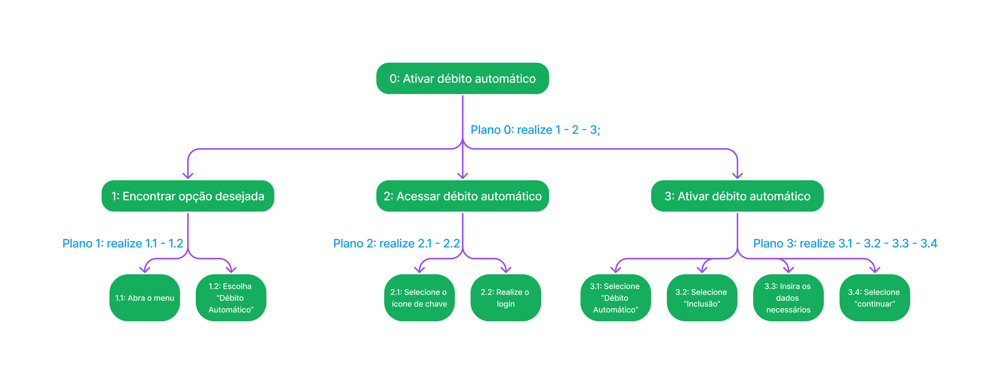
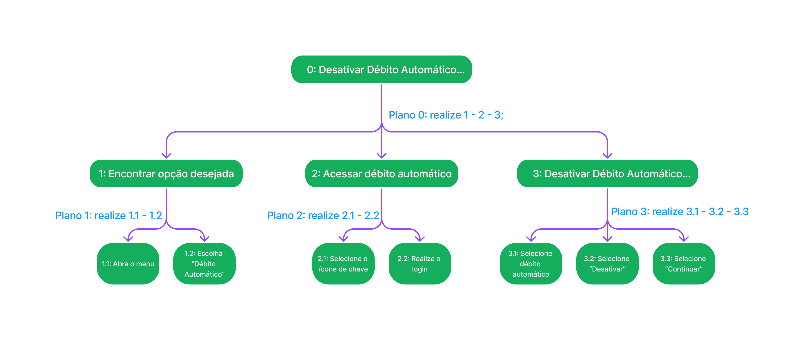
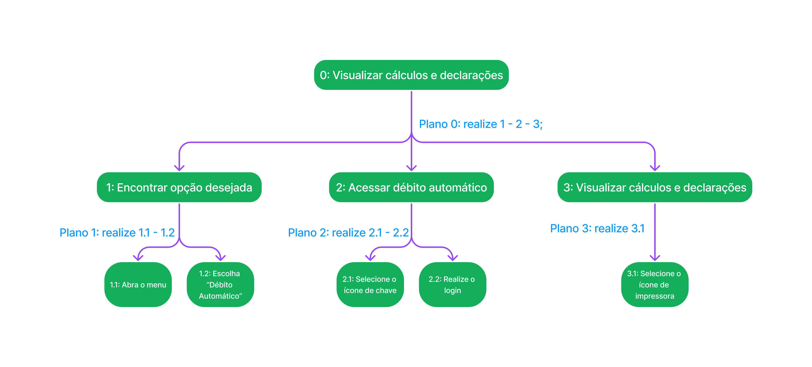

# Análise de tarefas

## <a>Histórico de Versão</a>
|Data|Data Prevista de Revisão|Versão|Descrição|Autor|Revisor|
| :----------: |:-----------:| :------: | :-----------: | :---------: |:---------: |
|03/12/2022|05/12/2022|1.0|Criação do documento|[Ana Luiza](https://github.com/AnHoff)|[Pedro Lucas](https://github.com/PedroLSF)|
|06/12/2022|07/12/2022|1.1|Adição do GOMS|[Pedro Lucas](https://github.com/PedroLSF)|[João Lucas](https://github.com/HacKairos)|
|07/12/2022|07/12/2022|1.2|Adição HTA|[Ana Luiza](https://github.com/AnHoff)|[Pedro Lucas](https://github.com/PedroLSF)|
|11/12/2022|11/12/2022|1.3|Ajustes no HTA|[Ana Luiza](https://github.com/AnHoff)|[Thiago](https://github.com/Thiab394)|

## <a>Introdução</a>
A análise de tarefas é uma atividade que pode ser realizada em diversas etapas do desenvolvimento, inclusive antes mesmo dele começar. Essa atividade consiste em analisar a situação atual do produto para determinar como cada tarefa é realizada, seja com o apoio de softwares externos ou não. Também é possível realizar a análise após a implementação de intervenções no sistema já existente.

Dois métodos foram escolhidos para realizar a análise de tarefas nesse projeto, são eles:

* Hierarchical Task Analysis, ou HTA;
* GOMS, sigla para Goals, Operators, Methods and Selection Rules.

## <a>HTA</a>
Hierarchical Task Analysis (HTA) ou, em português, Análise Hierárquica de Tarefas (AHT), usa como base as tarefas a serem realizadas a fim de atingir um objetivo do usuário. Abaixo é possível conferir as principais tarefas que um usuário procura utilizar através do Simples Nacional. A listagem foi disponibilizada com base nas propostas de notação textual e gráfica; para entender essa notação, veja o exemplo na figura 1 abaixo:
  

 
Figura 1 - Exemplo de notação gráfica (Fonte: [1])

 

Nas figuras de 2 a 8 e nas tabelas de 1 a 7 abaixo é possível conferir a execução da análise hierárquica de tarefas.  

#### <a>Incluir Débito Automático</a>

Figura 2 - Representação de como incluir débito automático (Elaboração própria: Ana)   

|Objetivos e tarefas|Descrição, Recomendações e Problemas|
|---|---|
|0 - Incluir débito automático (1>2)|**Plano:** encontrar a opção desejada, acessar o portal e ativar o débito automático|
|1 - Encontrar a opção desejada (1>2)|**Plano:** abrir o menu e selecionar a opção "Débito Automático" **Recomendação**: poderia ter uma seta, indicando que o menu é um dropdown
|1.1 - Abra o menu||
|1.2 - Escolha Débito Automático||
|2 - Acessar o débito automático (1>2)|**Plano:** entrar na área de login e logar **Recomendação**: trocar ícones e textos ambíguos por uma opção explícita de acesso|
|2.1 - Selecione o ícone de chave||
|2.2 - Realize o login|**Input**: dados pessoais|
|3 - Ativar o débito automático (1>2)|**Plano:** selecionar opção adequada, selecionar a opção adequada novamente, inserir dados e prosseguir|
|3.1 - Selecionar a opção débito automático|**Recomendação**: inclusão poderia ser uma sub-opção dessa etapa|
|3.2 - Selecionar "Inclusão"||
|3.3 - Insira os dados necessários|**Input**: dados do CNPJ|
|3.4 - Selecione continuar|**Recomendação**: poderia ser trocado de "continuar" para "confirmar"|

Tabela 1 - Detalhamento de atividades da figura 2

 

#### <a>Consultar Débito Automático</a>

Figura 3 - Representação de como consultar o débito automático (Elaboração própria: Ana)   

|Objetivos e tarefas|Descrição, Recomendações e Problemas|
|---|---|
|0 - Consultar débito automático (1>2)|**Plano:** encontrar a opção desejada, acessar o portal e consultar|
|1 - Encontrar a opção desejada (1>2)|**Plano:** abrir o menu e selecionar a opção "Débito Automático" **Recomendação**: poderia ter uma seta, indicando que o menu é um dropdown|
|1.1 - Abra o menu||
|1.2 - Escolha Débito Automático||
|2 - Acessar o débito automático (1>2)|**Plano:** entrar na área de login e logar **Recomendação**: trocar ícones e textos ambíguos por uma opção explícita de acesso|
|2.1 - Selecione o ícone de chave||
|2.2 - Realize o login|**Input**: dados pessoais|
|3 - Consultar o débito automático (1>2)|**Plano:** selecionar opção adequada, selecionar a opção adequada novamente e prosseguir|
|3.1 - Selecionar a opção débito automático|**Recomendação**: consulta poderia ser uma sub-opção do menu dessa etapa|
|3.2 - Selecionar "Consulta"||
|3.3 - Selecione continuar|**Recomendação**: poderia ser trocado de "continuar" para "confirmar"|

Tabela 2 - Detalhamento de atividades da figura 3

 

#### <a>Alterar Débito Automático</a>

Figura 4 - Representação de como alterar o débito automático (Elaboração própria: Ana)   

|Objetivos e tarefas|Descrição, Recomendações e Problemas|
|---|---|
|0 - Alterar débito automático (1>2)|**Plano:** encontrar a opção desejada, acessar o portal e alterar|
|1 - Encontrar a opção desejada (1>2)|**Plano:** abrir o menu e selecionar a opção "Débito Automático" **Recomendação**: poderia ter uma seta, indicando que o menu é um dropdown|
|1.1 - Abra o menu||
|1.2 - Escolha Débito Automático||
|2 - Acessar o débito automático (1>2)|**Plano:** entrar na área de login e logar **Recomendação**: trocar ícones e textos ambíguos por uma opção explícita de acesso|
|2.1 - Selecione o ícone de chave||
|2.2 - Realize o login|**Input**: dados pessoais|
|3 - Alterar o débito automático (1>2)|**Plano:** selecionar opção adequada, selecionar a opção adequada novamente, inserir dados e prosseguir|
|3.1 - Selecionar a opção débito automático|**Recomendação**: alteração poderia ser uma sub-opção do menu dessa etapa|
|3.2 - Selecionar "Alteração"||
|3.3 - Insira os dados necessários|**Input**: dados do CNPJ|
|3.4 - Selecione continuar|**Recomendação**: poderia ser trocado de "continuar" para "confirmar"|

Tabela 3 - Detalhamento de atividades da figura 4

 

#### <a>Desativar débito automático</a>

Figura 5 - Representação de como desativar o débito automático (Elaboração própria: Ana)   

|Objetivos e tarefas|Descrição, Recomendações e Problemas|
|---|---|
|0 - Desativar débito automático (1>2)|**Plano:** encontrar a opção desejada, acessar o portal e desativar |
|1 - Encontrar a opção desejada (1>2)|**Plano:** abrir o menu e selecionar a opção "Débito Automático" **Recomendação**: poderia ter uma seta, indicando que o menu é um dropdown|
|1.1 - Abra o menu||
|1.2 - Escolha Débito Automático||
|2 - Acessar o débito automático (1>2)|**Plano:** entrar na área de login e logar **Recomendação**: trocar ícones e textos ambíguos por uma opção explícita de acesso|
|2.1 - Selecione o ícone de chave||
|2.2 - Realize o login|**Input**: dados pessoais|
|3 - Desativar o débito automático (1>2)|**Plano:** selecionar opção adequada, selecionar a opção adequada novamente e prosseguir|
|3.1 - Selecionar a opção débito automático|**Recomendação**: desativar poderia ser uma sub-opção do menu dessa etapa|
|3.2 - Selecionar "Desativar"||
|3.3 - Selecione continuar|**Recomendação**: poderia ser trocado de "continuar" para "confirmar"|

Tabela 4 - Detalhamento de atividades da figura 5

 

#### <a>Visualizar cálculos e declarações</a>

Figura 6 - Representação de como visualizar cálculos e declarações (Elaboração própria: Ana)   

|Objetivos e tarefas|Descrição, Recomendações e Problemas|
|---|---|
|0 - Visualizar cálculos e declarações (1>2)|**Plano:** encontrar a opção desejada, acessar o portal e visualizar **Recomendação**: visualizar poderia ser uma opção que não dependa da geração de novas janelas no navegador|
|1 - Encontrar a opção desejada (1>2)|**Plano:** abrir o menu e selecionar a opção "Cálculo e Declaração" **Recomendação**: poderia ter uma seta, indicando que o menu é um dropdown|
|1.1 - Abra o menu||
|1.2 - Escolha Cálculo e Declaração||
|2 - Acessar o Cálculo e Declaração (1>2)|**Plano:** entrar na área de login e logar **Recomendação**: trocar ícones e textos ambíguos por uma opção explícita de acesso|
|2.1 - Selecione o ícone de chave||
|2.2 - Realize o login|**Input**: dados pessoais|
|3 - Visualizar cálculos e declarações|**Plano:** selecionar opção adequada|
|3.1 - Selecionar o desenho de uma impressora||

Tabela 5 - Detalhamento de atividades da figura 6

 

#### <a>Pagar on-line</a>

Figura 7 - Representação de como realizar pagamentos on-line (Elaboração própria: Ana)   

|Objetivos e tarefas|Descrição, Recomendações e Problemas|
|---|---|
|0 - Pagar on-line (1>2)|**Plano:** encontrar a opção desejada, acessar o portal e realizar o pagamento **Recomendação**: pagar deveria ser uma opção mais explícita no site|
|1 - Encontrar a opção desejada (1>2)|**Plano:** abrir o menu e selecionar a opção "Cálculo e Declaração" **Recomendação**: poderia ter uma seta, indicando que o menu é um dropdown|
|1.1 - Abra o menu||
|1.2 - Escolha Cálculo e Declaração||
|2 - Acessar o Cálculo e Declaração (1>2)|**Plano:** entrar na área de login e logar **Recomendação**: trocar ícones e textos ambíguos por uma opção explícita de acesso|
|2.1 - Selecione o ícone de chave||
|2.2 - Realize o login|**Input**: dados pessoais|
|3 - Pagar on-line|**Plano:** selecionar opção adequada|
|3.1 - Selecionar o desenho de um computador||

Tabela 6 - Detalhamento de atividades da figura 7

 

#### <a>Solicitar restituição</a>

Figura 8 - Representação de como solicitar a restituição (Elaboração própria: Ana)   

|Objetivos e tarefas|Descrição, Recomendações e Problemas|
|---|---|
|0 - Solicitar restituição (1>2)|**Plano:** encontrar a opção desejada, acessar o portal e solicitar o serviço|
|1 - Encontrar a opção desejada (1>2)|**Plano:** abrir o menu e selecionar a opção "Restituição" **Recomendação**: poderia ter uma seta, indicando que o menu é um dropdown|
|1.1 - Abra o menu||
|1.2 - Escolha Restituição||
|2 - Acessar área de restituição (1>2)|**Plano:** entrar na área de login e logar **Recomendação**: trocar ícones e textos ambíguos por uma opção explícita de acesso|
|2.1 - Selecione o ícone de chave||
|2.2 - Realize o login|**Input**: dados pessoais|
|3 - Solicitar restituição (1>2)|**Plano:** acessar a página adequada, inserir ano e prosseguir|
|3.1 - Selecionar "Solicitar Restituição"||
|3.2 - Digitar o ano na área "PA"|**Input**: inserir ano para restituir |
|3.3 - Selecione continuar|**Recomendação**: poderia ser trocado de "continuar" para "confirmar"|

Tabela 7 - Detalhamento de atividades da figura 8

 

## <a>GOMS</a>
GOMS é a abreviação de 4 termos utilizados nesse método, seriam eles Goals, Operators, Methods e Selection Rules. Vamos entender um pouco mais sobre o método GOMS:

É um métodos de análise de tarefas que permite a representação do conhecimento necessário para a realização de uma tarefa por parte de um usuário. Nessas representações podemos encontrar goals que são as metas e submetas que o usuário deseja fazer, operators que são as ações que o software permite que o usuário tome e que são diretamente relacionadas com o dispositivo em si, methods que são sequências claras de goals e operators que permitem o usuário concluir uma tarefa, selection rules que são as regras que o usuário pode seguir para decidir qual método usará para atingir uma goal.

### <a>Objetivos</a>
* Incluir o Débito Automático

1. Method 1: Pelo CNPJ
   
    1. **Goal 0:** Acessar o Débito Automático
       
        1. OP 0.1: Deslocar o mouse até o quadrado escrito "Simei";
        2. OP 0.2: Apertar o botão esquerdo em "Débito Automático";
        3. OP 0.3: Clicar na chave dentro de "Código de Acesso";
        4. OP 0.4: Preencher o campo de "CNPJ";
        5. OP 0.5: Preencher o campo de "CPF";
        6. OP 0.6: Preencher o campo de "Código de Acesso";
        7. OP 0.7: Preencher o campo de caracteres;
        8. OP 0.8: Deslocar o mouse até o quadrado escrito "Continuar";
        9. OP 0.9: Apertar o botão esquerdo do Mouse;
    
    2. **Goal 1:** Incluir o Débito Automático
        1. OP 1.1: Deslocar o mouse até "Débito Automático";
        2. OP 1.2: Apertar o botão esquerdo do Mouse;
        3. OP 1.3: Selecionar "Inclusão";
        4. OP 1.4: Digitar os dados;
        5. OP 1.5: Deslocar o mouse para "Continuar";
        6. OP 1.6: Apertar o botão esquerdo do Mouse;
        
* Consultar o Débito Automático

1. Method 1: Pelo CNPJ
    1. **Goal 0:** Acessar o Débito Automático
        
        1. OP 0.1: Deslocar o mouse até o quadrado escrito "Simei";
        2. OP 0.2: Apertar o botão esquerdo em "Débito Automático";
        3. OP 0.3: Clicar na chave dentro de "Código de Acesso";
        4. OP 0.4: Preencher o campo de "CNPJ";
        5. OP 0.5: Preencher o campo de "CPF";
        6. OP 0.6: Preencher o campo de "Código de Acesso";
        7. OP 0.7: Preencher o campo de caracteres;
        8. OP 0.8: Deslocar o mouse até o quadrado escrito "Continuar";
        9. OP 0.9: Apertar o botão esquerdo do Mouse;
    
    2. **Goal 1:** Consultar o Débito Automático
        
        1. OP 1.1: Deslocar o mouse até "Débito Automático";
        2. OP 1.2: Apertar o botão esquerdo do Mouse;
        3. OP 1.3: Selecionar "Consulta";
        5. OP 1.4: Deslocar o mouse para "Continuar";
        6. OP 1.5: Apertar o botão esquerdo do Mouse;
        
* Alterar o Débito Automático

1. Method 1: Pelo CNPJ
   
    1. **Goal 0:** Acessar o Débito Automático
  
        1. OP 0.1: Deslocar o mouse até o quadrado escrito "Simei";
        2. OP 0.2: Apertar o botão esquerdo em "Débito Automático";
        3. OP 0.3: Clicar na chave dentro de "Código de Acesso";
        4. OP 0.4: Preencher o campo de "CNPJ";
        5. OP 0.5: Preencher o campo de "CPF";
        6. OP 0.6: Preencher o campo de "Código de Acesso";
        7. OP 0.7: Preencher o campo de caracteres;
        8. OP 0.8: Deslocar o mouse até o quadrado escrito "Continuar";
        9. OP 0.9: Apertar o botão esquerdo do Mouse;
        
    2. **Goal 1:** Alterar o Débito Automático
        
        1. OP 1.1: Deslocar o mouse até "Débito Automático";
        2. OP 1.2: Apertar o botão esquerdo do Mouse;
        3. OP 1.3: Selecionar "Alteração";
        4. OP 1.4: Digitar os dados;
        5. OP 1.5: Deslocar o mouse para "Continuar";
        6. OP 1.6: Apertar o botão esquerdo do Mouse;

* Desativar o Débito Automático

1. Method 1: Pelo CNPJ
    1. **Goal 0:** Acessar o Débito Automático
      
        1. OP 0.1: Deslocar o mouse até o quadrado escrito "Simei";
        2. OP 0.2: Apertar o botão esquerdo em "Débito Automático";
        3. OP 0.3: Clicar na chave dentro de "Código de Acesso";
        4. OP 0.4: Preencher o campo de "CNPJ";
        5. OP 0.5: Preencher o campo de "CPF";
        6. OP 0.6: Preencher o campo de "Código de Acesso";
        7. OP 0.7: Preencher o campo de caracteres;
        8. OP 0.8: Deslocar o mouse até o quadrado escrito "Continuar";
        9. OP 0.9: Apertar o botão esquerdo do Mouse;
        
    2. **Goal 1:** Desativar o Débito Automático
        
        1. OP 1.1: Deslocar o mouse até "Débito Automático";
        2. OP 1.2: Apertar o botão esquerdo do Mouse;
        3. OP 1.3: Selecionar "Desativação";
        5. OP 1.4: Deslocar o mouse para "Continuar";
        6. OP 1.5: Apertar o botão esquerdo do Mouse;

* Visualizar os cálculos e declarações

1. Method 1: Pelo CNPJ
    1. **Goal 0:** Acessar o cálculo e declaração
   
        1. OP 0.1: Deslocar o mouse até o quadrado escrito "Simei";
        2. OP 0.2: Apertar o botão esquerdo em "Cálculo e declaração";
        3. OP 0.3: Clicar na chave dentro de "Código de Acesso";
        4. OP 0.4: Preencher o campo de "CNPJ";
        5. OP 0.5: Preencher o campo de "CPF";
        6. OP 0.6: Preencher o campo de "Código de Acesso";
        7. OP 0.7: Preencher o campo de caracteres;
        8. OP 0.8: Deslocar o mouse até o quadrado escrito "Continuar";
        9. OP 0.9: Apertar o botão esquerdo do Mouse;
        
    2. **Goal 1:** Visualizar cálculo e declaração
   
        1. OP 1.1: Deslocar o mouse até o desenho de uma impressora;
        2. OP 1.2: Apertar o botão esquerdo do Mouse;

* Pagar de forma on-line calculos e declarações

1. Method 1: Pelo CNPJ
    1. **Goal 0:** Acessar o Débito Automático
   
        1. OP 0.1: Deslocar o mouse até o quadrado escrito "Simei";
        2. OP 0.2: Apertar o botão esquerdo em "Cálculo e decração";
        3. OP 0.3: Clicar na chave dentro de "Código de Acesso";
        4. OP 0.4: Preencher o campo de "CNPJ";
        5. OP 0.5: Preencher o campo de "CPF";
        6. OP 0.6: Preencher o campo de "Código de Acesso";
        7. OP 0.7: Preencher o campo de caracteres;
        8. OP 0.8: Deslocar o mouse até o quadrado escrito "Continuar";
        9. OP 0.9: Apertar o botão esquerdo do Mouse;
        
    2. **Goal 1:** Visualizar cálculo e declaração
        
        1. OP 1.1: Deslocar o mouse até o desenho de computador;
        2. OP 1.2: Apertar o botão esquerdo do Mouse;

* Solicitar Restituição

1. Method 1: Pelo CNPJ
   
    1. **Goal 0:** Acessar o Débito Automático
   
        1. OP 0.1: Deslocar o mouse até o quadrado escrito "Simei";
        2. OP 0.2: Apertar o botão esquerdo em "Restituição";
        3. OP 0.3: Clicar na chave dentro de "Código de Acesso";
        4. OP 0.4: Preencher o campo de "CNPJ";
        5. OP 0.5: Preencher o campo de "CPF";
        6. OP 0.6: Preencher o campo de "Código de Acesso";
        7. OP 0.7: Preencher o campo de caracteres;
        8. OP 0.8: Deslocar o mouse até o quadrado escrito "Continuar";
        9. OP 0.9: Apertar o botão esquerdo do Mouse;
        
    2. **Goal 1:** Solicitar Restituição
       
        1. OP 1.1: Deslocar o mouse até "Solicitar Restituição";
        2. OP 1.2: Apertar o botão esquerdo do Mouse;
        3. OP 1.3: Deslocar o mouse até a caixa de texto de "PA";
        4. OP 1.4: Digitar o ano;
        5. OP 1.5: Deslocar o mouse para "Continuar";
        6. OP 1.6: Apertar o botão esquerdo do Mouse;

## <a>Bibliografia</a>
[1] BARBOSA, Simone; DINIZ, Bruno. Interação Humano-Computador. Editora Elsevier, Rio de Janeiro, 2010 
